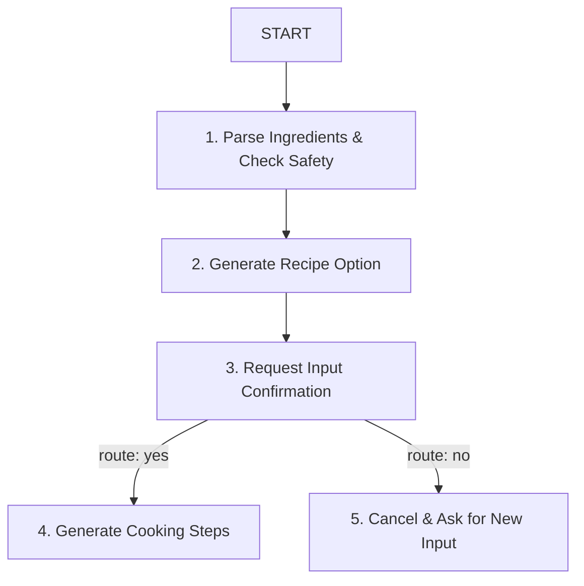

# 🍳 ChefAgent: AI Kitchen Assistant

ChefAgent is a premium, user-friendly AI Kitchen Assistant powered by the **Google GenAI SDK** and the **ADK 2.0 Graph Workflow API**. It helps users minimize food waste, save cooking time, and follow encouraging, beginner-friendly culinary instructions.

---

## 🌟 Key Features

- **ADK 2.0 Graph Workflow**: Implements a robust state machine workflow to handle parsing, recipe generation, human-in-the-loop (HITL) confirmations, and cooking guide compilation.
- **Safety Validation Gate**: A built-in security check intercepts spoiled/expired ingredients (e.g., "rotten eggs") and dangerous chemical combinations (e.g., "bleach + ammonia") before they enter the workflow.
- **Culinary Expert Profile**: Configured to follow strict zero-waste directives, prioritize quick preparation times (under 30 minutes), and speak in an encouraging chef persona.
- **Streamlit Web UI**: A clean, modern user interface featuring:
  - Text area for listing ingredients.
  - Slider for cooking time preferences.
  - Interactive Human-in-the-Loop recipe confirmation prompt.
  - Step-by-step cooking instructions card layout.
  - Seamless `.env` integration to securely load Gemini API credentials.

---

## 🏗️ Workflow Architecture

The agent runs as a structured graph using the ADK 2.0 Workflow API:



---

## 🚀 Getting Started

### Prerequisites
Ensure you have the following installed:
- **Python**: Version `3.11` to `3.14`
- **uv**: A fast Python package installer and manager.

### 1. Installation
Clone the repository and install the dependencies into a local virtual environment:
```bash
uv sync
```

### 2. Configure Credentials
Create a `.env` file in the project root:
```env
GEMINI_API_KEY=your_gemini_api_key_here
GOOGLE_GENAI_USE_VERTEXAI=False
```
*(Note: `.env` is automatically added to `.gitignore` to keep your credentials secure.)*

### 3. Launching the Streamlit UI
Run the Streamlit application from the project root directory:
```bash
.\.venv\Scripts\streamlit run app/ui.py
```
Open `http://localhost:8501` in your browser.

---

## 📂 Project Structure

```
chef-agent/
├── .agents/                    # Agent configurations & skill profiles
│   └── skills/
│       └── culinary_expert.md  # Tone & zero-waste instructions
├── app/                        # Core application code
│   ├── agent.py                # Main ADK 2.0 Graph Workflow
│   ├── ui.py                   # Streamlit Frontend application
│   ├── agent_runtime_app.py    # Runtime server configuration
│   └── app_utils/              # Typing & telemetry utilities
├── .env                        # Local secret configurations (ignored by git)
├── pyproject.toml              # Dependencies & packages
└── tests/                      # Unit & integration tests
```

---

## 🛠️ CLI Commands

| Command              | Description                                                                                 |
| -------------------- | ------------------------------------------------------------------------------------------- |
| `agents-cli install` | Install dependencies using uv                                                               |
| `agents-cli playground` | Launch local development environment                                                       |
| `agents-cli lint`    | Run code quality checks                                                                     |
| `agents-cli eval`    | Evaluate agent behavior (generate, grade, analyze, and more)                               |
| `uv run pytest`      | Run unit and integration tests                                                              |
| `agents-cli deploy`  | Deploy agent to Agent Runtime                                                               |
