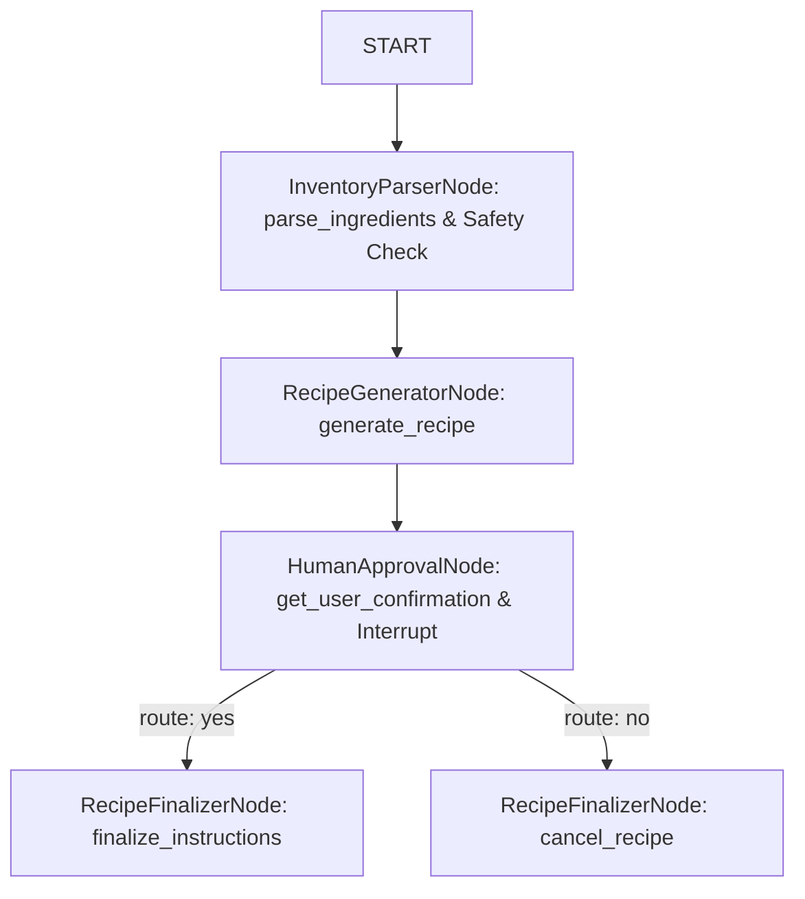

# 🍳 ChefAgent: Smart Kitchen Inventory & Anti-Waste Assistant (Freestyle Track)

ChefAgent is a premium, user-friendly AI Kitchen Assistant powered by the **Google GenAI SDK** and the **ADK 2.0 Graph Workflow API**. Built inside the Antigravity IDE environment, it minimizes household food waste by transforming custom kitchen ingredients into structured recipe plans. It enforces robust security validation and enables stateful Human-in-the-Loop (HITL) confirmations via a modern Streamlit user interface.

---

## 🚀 Problem Statement

Household food waste is a major global economic and environmental challenge. Millions of tons of food are discarded annually due to poor planning and difficulty in tracking ingredient expiration windows. Standard search engines and static recipe apps require users to match exact ingredients or search pre-existing indexes, often resulting in recipes that require *more* shopping, further compounding waste. Furthermore, standard tools lack real-time safety gating, allowing users to accidentally attempt cooking with spoiled, expired, or chemically hazardous combinations.

---

## 🧠 Solution Design & Value

ChefAgent addresses these challenges by employing a **Reasoning Agent Workflow** rather than static database queries:
1. **Dynamic Inventory Adaptation**: Instead of querying database tables, the agent uses Gemini reasoning to suggest creative recipes that maximize the use of available ingredients to optimize for zero food waste.
2. **Intentional User Control**: It doesn't just output a recipe; it requests confirmation via an explicit interrupt, ensuring the user can approve or decline the recommendation before generating final instructions.
3. **Food Safety Validation**: It acts as a safety shield, parsing the input and immediately aborting the run if hazardous items or spoiled foods are entered.

---

## 🏗️ Technical Architecture & ADK 2.0 Workflow

The ChefAgent is structured as a directed graph workflow utilizing the **ADK 2.0 Graph Workflow API**.

### 1. State Schema (`KitchenState`)
A global shared memory object implemented using Pydantic:
- `raw_input`: Captured raw text inputs.
- `structured_inventory`: Cleaned list of parsed food ingredients.
- `selected_recipe`: The creative recipe chosen by the agent.
- `final_instructions`: Detailed cooking instructions or cancellation directions.

### 2. Functional Nodes
The graph consists of the following functional nodes:
- **`InventoryParserNode`** (implemented as `parse_ingredients`): Receives the raw user input, structures individual ingredients into a clean JSON list, and performs real-time validation checks for expired, rotten, or hazardous substances.
- **`RecipeGeneratorNode`** (implemented as `generate_recipe`): Evaluates the structured list of ingredients and suggests a creative recipe maximizing the use of what's already in the kitchen.
- **`HumanApprovalNode`** (implemented as `get_user_confirmation`): Pauses execution using `RequestInput` to prompt the user to confirm the suggested recipe, enabling stateful resumption.
- **`RecipeFinalizerNode`** (implemented as `finalize_instructions` and `cancel_recipe`): Routes the execution based on the user's input. If approved, it generates detailed step-by-step cooking steps. If rejected, it cleans up and aborts the workflow.

### 3. Graph Routing Layout



---

## 🛠️ Course Concepts Covered

This project demonstrates the practical application of three key AI Agent developer concepts:

1. **Antigravity IDE Workspace**: The project structure, packages, scaffolding, and local environment variables were managed entirely inside the developer workspace.
2. **ADK 2.0 Graph Workflow API**: The entire agent logic is represented as a directed graph rather than linear code, enabling clean state transitions, conditional routing, and stateful Human-in-the-Loop interrupts (`RequestInput`).
3. **Custom Agent Skills (`culinary_expert.md`)**: Configured at `.agents/skills/culinary_expert.md`, this profile instructs the LLM to optimize for zero food waste, prioritize quick prep times (under 30 minutes), and adopt a beginner-friendly chef persona.

---

## 🔒 Security & Safety Features

To prevent dangerous food combinations or consumption of spoiled items, ChefAgent implements a strict safety validation gate:
- **Deny-by-Default Validation**: If the parsed ingredients contain spoiled items (`rotten`, `moldy`, `expired`, `spoiled`), the agent immediately raises a `ValueError`, halting workflow execution.
- **Hazardous Combinations Block**: Explicit checks prevent toxic chemical combinations (such as `bleach + ammonia` which releases harmful chloramine gas) from being processed.
- **Immediate Interception**: The safety validation happens in the very first node (`InventoryParserNode`) before any other nodes execute, preventing invalid state changes.

---

## 💻 Setup & Installation Instructions

### Prerequisites
Ensure you have the following installed:
- **Python**: Version `3.11` to `3.14`
- **uv**: Python package installer and manager.

### 1. Clone & Install Dependencies
Navigate into the repository and synchronize dependencies:
```bash
uv sync
```

### 2. Configure Environment Credentials
Create a `.env` file in the root of the project:
```env
GEMINI_API_KEY=your_gemini_api_key_here
GOOGLE_GENAI_USE_VERTEXAI=False
```

### 3. Launching the Streamlit Web Application
Run the Streamlit application using your virtual environment:
```bash
.\.venv\Scripts\streamlit run app/ui.py
```
Open your browser and navigate to `http://localhost:8501`.
